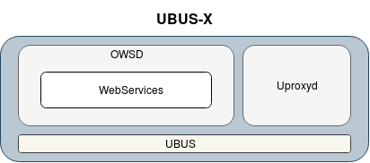

# UBUS-X

## 1 Intro
This section will cover the basics of ubusproxy (ubus-x) and why was it developed.

### 1.1 What is Ubus-x?
Ubus-x offers a way to communicate and access ubus objects and methods from other nodes on the network, which are also running iopsys. Ubus-x is unidirectional, meaning that only the master will be able to access objects and methods of devices underneath it in the topology.

### 1.2 Why was Ubus-x Developed
Ubus-x allows applications to have access to more granular network information, thus allowing the master node to exercise increased control over the network. An example being WiFi Life, the master gathers information from its extenders and repeaters to make a decision on which node would be the highest performing access point for a wireless client.

## 2 How Does it Work
This section will cover some information of the codebases on which ubus-x is built, as well as some more in-depth information on how ubus-x is setup.

## 2.1 Components
Ubus-x has two essential codebases and daemons, communicating with eachother through ubus. The daemons are owsd and uproxyd.



### 2.1.1 OpenWRTWebSocketDaemon
The OpenWRTWebSocketDaemon (owsd) holds the most central part of ubus-x. Owsd is the daemon which hosts the WebSocket and the proxy objects on ubus. Furthermore, owsd is also responsible for hosting the iopsys webGUI, managing connections to it and converting http connections to WebSocket connections. The daemon is built on top of the library libWebSockets.

### 2.1.2 Uproxyd
Another integral part of ubus-x is uproxyd, a daemon that is a part of the quest package. Uproxyd listens for `client` events published on the local bus.
```
{ "client": {"action":"disconnect","macaddr":"06:0c:43:26:60:a8","ipaddr":"192.168.1.109","network":"lan"} }
{ "client": {"action":"connect","macaddr":"06:0c:43:26:60:a8","ipaddr":"192.168.1.109","network":"lan"} }
```
When an event is received uproxyd will gather some client information and pass it to owsd by invoking its ubus methods, `owsd.ubusproxy add` or `owsd.ubusproxy remove`, for connect and disconnect events respectively.


### 2.2 WebSocket Connections
When owsd is alerted of a new connection, a struct containing all client information is prepared for libWebSockets, the struct holds addresses, ports and certificates among other things. An attempt is then made to open a connection to the remote WebSocket, in this scenario the master gateway acts as client, relaying local calls accessing proxy objects to the client on which they are hosted.

After the attempted connection, libWebSockets will utilize a callback, set at initialization, stating that a client connection was establish. An establish callback will be received regardless of successful the certificate authentication, so a normal client (which will not hold the correct certificates) will be retried till a limit is reached, at which point it is dropped. If it was in fact a repeater or extender, a chain of events is initiated that will:

1. Tell the device to replay all the ubus events over the socket.
2. Fetch a list of all objects accessible on the remote bus.

When the master receives the list of accessible objects, a stub will be created for each remote object, used to publish the remote object on the local bus.


## 2.3 Proxy Objects
Proxy objects are available on the local bus at the master. These objects are prefixed with the IP address of the client hosting them.

```
root@iopsys:~# ubus list 192*
192.168.1.121/netmode
192.168.1.121/router.system
192.168.1.121/wifi.agent
192.168.1.121/wifi.fbt
192.168.1.121/wifix
```

From a user perspective, these objects behave in the same way as any other objects on ubus.

```
root@iopsys:~# ubus call 192.168.1.121/wifix stas
{
	"ra0": [

	],
	"rai0": [
		{
			"macaddr": "9c:b6:d0:f1:be:fb",
			"frequency": "5GHz",
			"rssi": -26,
			"snr": 64,
			"in_network": 14,
			"flags": {
				"wme": true,
				"ps": false,
				"n_cap": true,
				"vht_cap": true,
				"ampdu": false,
				"amsdu": false,
				"ldpc": true,
				"stbc": true,
				"sgi": true,
				"bfr": false,
				"bfe": false
			},
			"stats": {
				"tx_total_pkts": 14,
				"tx_total_bytes": 2268,
				"tx_failures": 0,
				"tx_pkts_retries": 0,
				"tx_drop_pkts": 0,
				"tx_pkts_retry_exhausted": 0,
				"tx_data_pkts_retried": 0,
				"rx_data_pkts": 66,
				"rx_data_bytes": 12597,
				"rx_failures": 0,
				"rx_drop_pkts": 0,
				"rate_of_last_tx_pkt": 780,
				"rate_of_last_rx_pkt": 866,
				"max_rate": 866
			},
			"rssi_per_antenna": [
				-26,
				-25,
				-26,
				-30
			]
		}
	]
}
```

### 2.3.1 Performing a Remote Call
During the ubus-x protocol initialization, after the remote list is established and a stub (the local representation of a remote object) is created, a callback handler is set for each method. When the remote method is called at the master, this callback handler will transform the request into a jsonrpc, which is passed through the WebSocket to the client hosting the method.

At the other end of the WebSocket the client will receive the payload in a callback from libWebSockets, parse the request and use the ubus C library to invoke that method. The response is parsed to jsonrpc and passed back through the WebSocket to the master.

Prior to making the request, the master marks an unsigned integer with a bit, shifted by the object id, it is then able to identify the correct response and print it to ubus.


## 2.4 Certificates
____####TODO: Make sure this information is correct####____

Ubus-x uses transport layer security (TLS) to authenticate the WebSocket connections. TLS, the successor of SSL, is a cryptographic protocol using certificates and keys to authenticate, encrypt and decrypt messages.

Each client has a private key and a public key. The private is known only to themselves, and is used to decrypt messages that are encrypted using their public key, as well as for signing messages. The public key is passed to everyone who wishes to communicate with the client, and should be used to encrypt messages meant for the recipient who holds the corresponding private key.

Traditionally there is a third party involved, a certificate authority (CA), who verifies whether a public key and certificate is from a trusted source, however, ubus-x uses self-signed certificates. Self-signing a certificate means that the server signs its own certificate and acts as a CA for itself.

In the case of ubus-x, self-signed certificates provide adequate security. While the certificates are not authenticated by a third party, the CA certificate and key comes pre-installed on the box, and can be used to sign certificates. These certificates can be verified by all iopsys devices, as they have the means to unlock it.

### 2.4.1 Certificate Generation
In order to use ubus-x, certificates and keys have to be prepared, or generated, on the device. CA certificates comes pre-installed, while device specific certificates and keys will be generated on first boot.

1. First a private key is generated.
```
openssl genrsa -out ubusx.key 2048
```
2. Next the certificate signing request (CSR) should be generated. A CSR contains a public key, identify information, and a digital signature. CSRs are usually sent to a CA to apply for a digital identify certificate, however for ubus-x it will be used to create a self-signed certificate.
```
openssl req -new -sha256 -key ubusx.key -subj "/C=SE/ST=Stockholm/O=iopsys, Inc./CN=ubusx" -out ubusx.csr
```
3. Finally a certificate is generated, which is signed using the pre-installed CA certificate and key.
```
openssl x509 -req -in ubusx.csr -CA ubusxCA.crt -CAkey ubusxCA.key -CAcreateserial -out ubusx.crt -days 500 -sha256
```

__END-TODO__

### 2.4.2 Ubus-x Certificate Usage
Owsd takes different flags providing the paths of each certificate and key used for authentication.

Master-side certificates:
```
  -C <cert_path>   SSL client cert path
  -K <cert_path>   SSL client key path
  -A <ca_file>     SSL CA file path trusted by client
```

Client-side certificates:
```
  -c <cert_path>   SSL cert path if SSL wanted
  -k <key_path>    SSL key path if SSL wanted
  -a <ca_file>     path to SSL CA file that makes clients trusted
```
The first two parameters (`-C and -K` or `-c and -k`) are the certificate and key generated at boot up, while the third is the pre-installed CA certificate.

These paths are in the code included in a context used for virtual host creation by libWebSockets, and will be utilized to authenticate an attempted connection by another device.

## 2.5 Access Lists
A security feature that ubus-x offers are access lists. Access lists are a list of objects that the device wants to expose to the master node. These lists will only limit access to ubus objects from a device authenticated via TLS, and do not affect users signed in via the session ID (such as the GUI).

```
-X <ubusobject>[->method][,...]
                   ACL list controlling wich local ubus objects are
                   allowed to be exported to remote ubuses/ubux
                   Example: -X "object1,object2->method,object3"
```

Access lists function on a white-list basis, meaning that only objects explicitly provided in the configuration file will be accessible from the master side. However, if no list is specified, by default every object is white-listed.

The access lists are provided in `/etc/config/owsd` and parsed by the init.d script, `/etc/init.d/owsd`, and passed as arguments to owsd via the `-X` flag.
## 2.6 Object Lists
Object lists offer filtering of proxy objects on the master-side, while functionality wise offering similar functionality as access lists, an object list serves no purpose other than to limit the objects visually displayed when performing a ubus list. Even though objects that are filtered on master side do not show when performing ubus list, they will still be reachable when attempting to call them.

Similarly to access lists, object lists are white-list based, with a default that white-lists all objects. The object list is specified in the configuration file, and will be passed with the -U flag to owsd.
```
  -U [<path>] ...  Enable WS ubus proxying [for ubus path]
```

## 3 How to Set Up
This section describes how to prepare configuration files in order to use ubus-x.

### 3.1 UCI configuration
Configuring your device for ubus-x can be done through its UCI configuration file, `/etc/config/owsd`.
There are two sections of interest when configuring ubus-x, `config ubusproxy ‘ubusproxy’` and `config owsd-listen ‘wan_https’`.

### 3.2 Enabing Ubus-x
The configuration `option enable` is set or unset depending on whether the device should act as a client trying to connect to remotes, or as a server accepting connections.

#### 3.2.1 Master Side
The master is the device attempting to connect to remotes, meaning that `option enable ‘1’` must be set at the master node.

```
section ubusproxy ‘ubusproxy’
	option enable ‘1’
	option peer_key '/etc/ubusx/ubusx.key'
	option peer_cert '/etc/ubusx/ubusx.crt'
	option peer_ca '/etc/ubusx/ubusxCA.crt'
	list object 'netmode'
	list object 'router.*'
```
#### 3.2.2 Client Side
What from a network perspective is considered client, is from a ubus-x perspective acting as a server, hosting the objects and methods, meaning option enable should be set to 0.
```
section ubusproxy ‘ubusproxy’
	option enable ‘0’
```

### 3.3 Certificates
For authentication, libWebSockets uses the TLS protocol, meaning SSL certificates are required to be available on the device. The file paths of the certificates and keys have to be provided to owsd, and are read from the uci configuration file by its proc.d script. For more on certificates and how to generate them, see section _2.4 Certificates_ and _2.4.1 Certificate Generation_.

#### 3.3.1 Master Side
On the master side the certificates for ubus-x should be given under `config ubusproxy 'ubusproxy'`. The three files necessary are: an SSL private key (`option peer_key`), SSL certificate (`option peer_cert`) and a certificate authority file (`option peer_ca`). The key and certificate are generated at first boot by uci-default scripts, while the CA certificate comes pre-installed. The paths of these keys should at the master be included in the `ubusproxy` section.
```
section ubusproxy ‘ubusproxy’
	option enable ‘1’
	option peer_key '/etc/ubusx/ubusx.key'
	option peer_cert '/etc/ubusx/ubusx.crt'
	option peer_ca '/etc/ubusx/ubusxCA.crt'
	list object 'netmode'
	list object 'router.*'
```

#### 3.3.2 Client Side
On the client side, the certificates should be provided under a different section, `config owsd-listen ‘wan_https’`, seeing as we will be accepting the client connection from the wan side, over a secure (TLS) connection.

The section should look similar to:
```
config owsd-listen 'wan_https'
	option port '443'
	option interface 'wan'
	option key '/etc/ubusx/ubusx.key'
	option cert '/etc/ubusx/ubusx.crt'
	option ca '/etc/ubusx/ubusxCA.crt'
	option whitelist_interface_as_origin '1'
	list ubusx_acl 'netmode'
	list ubusx_acl 'router*'
	list ubusx_acl 'wifi*'
```

### 3.4 Setting up Object Lists
Object lists are a way to perform filtering based on what proxy objects the user wants to display when performing ubus list on the master. In the configuration file this is specified under `list object <obj_name>`. When specifying the object to white-list, wild cards are accepted at the end of the object name.
```
section ubusproxy ‘ubusproxy’
	option enable ‘1’
	option peer_key '/etc/ubusx/ubusx.key'
	option peer_cert '/etc/ubusx/ubusx.crt'
	option peer_ca '/etc/ubusx/ubusxCA.crt'
	list object 'netmode'
	list object 'router.*'
```

### 3.5 Setting up Access Lists
Access lists provide a way to perform filtering on the server side, meaning the device hosting the objects. Only objects that should be shared upstream are to be included in the access lists.

This list should be provided in section `config owsd-listen ‘wan_https’` under `list ubusx_acl <obj_name>`, and similarly to object lists, wild cards are accepted at the end of an object name.
```
config owsd-listen 'wan_https'
	option port '443'
	option interface 'wan'
	option key '/etc/ubusx/ubusx.key'
	option cert '/etc/ubusx/ubusx.crt'
	option ca '/etc/ubusx/ubusxCA.crt'
	option whitelist_interface_as_origin '1'
	list ubusx_acl 'netmode'
	list ubusx_acl 'router*'
	list ubusx_acl 'wifi*'
```
<!---
### 3.6 Certificates

Ubus-x uses TLS in order to authenticate a remote, thus requiring both devices that are to be synced  to have SSL certificates configured and prepared. Your device should already have certificates prepared, paths may differ depending on customization, but usually ubus-x certificates can be found under `/etc/ubusx/`. These certificate paths should be provided in the uci configuration, see section 3.3.1 and 3.3.2.
--->
___
## 4 Developer Docs

This section will cover more indepth details of the code and how ubus-x is setup. Looking into the .c files, what functions are used and what their scope is.

### 4.1 Uproxyd

Uproxyd is a standalone daemon and is currently a part of the quest package. Uproxyd is compiled with two files, `uproxyd.c` containing all its logic, and `tools.c`, containing some generic utility functions.

At startup the daemon will register an event handler for `client` events, using an event callback that passes the event action and IP address to `owsd.ubusproxy add` or `owsd.ubusproxy remove`.

Secondly uproxyd schedules a one time check for all connected clients, invoking `router.network clients` to gather a list of currently connected clients, parse their connection status, and for all connected clients invoke `owsd.ubusproxy add` passing the IP address as argument.

The final task for Uproxyd is to every five seconds poll for stale clients through `owsd.ubusproxy list`. Stale clients are clients that are marked as disconnected by OWSD, failing certificate authentication, or removed for any other reason. If a client reaches a retry_count of 10, uproxyd notifies owsd by invoking `owsd.ubusproxy remove` with the clients IP address, and then resumes polling at the interval.

### 4.2 OpenWRTWebSocketDaemon

Owsd is a multi purpose daemon developed to manage websocket features. Owsd is largely dependent on the WebSocket library LibWebSocket, with all WebSocket interaction being performed from within the library, providing us with callbacks on connections, disconnects, messages, etc.

#### 4.2.1 Ubus-x overview

__###TODO: section looks a bit messy?###__
##### 4.2.1.1 Files
This section will cover the most important files from a remote and master perspective and briefly describing some relevant functions.
##### 4.2.1.1.1 Remote
`wsubus.c` - Contains the protocol, remote callback handler, transmission parsing functions.

Most relevant functions:
1.  `wsubus_cb(5)` - Server side callback of WebSocket.
2.  `wsubus_rx` - Check that payload is not too large, send to correct handler.
3.  `wsubus_rx_json` - Converts the payload to a `struct json_object`.
4.  `wsu_on_msg_from_client` - Parses the response and initiates the appropriate process.

`wsubus.impl.h` - Contains functions to write to WebSocket, peer initialization functions and various methods to get client or peer from container.

Relevant functions:
1. `wsubus_tx_text` - Drains write queue and publishes it on WebSocket.
2. `wsu_peer_deinit` - Clean the private memory of a leaving connection.
3. `wsu_peer_init` - Initiate some private memory of an established connection.
4. `wsu_queue_write_str` - Append data to the write queue.

`rpc_*.c` - Remote procedure calls, such as ubus-x calls to the local bus from a WebSocket client.

##### 4.2.1.1.2 Master
`ws_ubusproxy.c` - Has the client side callback, handler and protocol.

Relevant functions:
1. `ws_ubusproxy_cb(5)` - Does all the parsing and logic on WebSocket callbacks.

`wsubus_client.c` - Holds most of the overhead of ubus-x, such as its ubus object and managing and setting up connections to remotes.

Relevant functions:
1. `wsubus_client_create(4)` - Initiates a a new clients data.
2. `utimer_reconnect_cb(1)` - Attempts to establish a connection to a client via LibWebSocket.

`util_jsonrpc.c` - Prepare RPC requests.

Relevant functions:
1. `jsonrpc__req_to_string(7)` - Prepares a jsonrpc.

`local_stub.c` - Represents remote objects on ubus.

Relevant functions:
1. `static int wsu_local_stub_handle_call(5)` - The callback used when calling a remote object.
2. `struct wsu_local_stub* wsu_local_stub_create(3)` - Create a stub and publish the remote object to the local bus.

##### 4.2.1.1.3 Ubus-x Access Lists
`access_check.c` - Holds the logical components of performing an access check.

Relevant functions:
1. `wsu_ext_check_tls(2)` - Establish if connection has a valid certificate, call access list check operation.
2. `wsubus_access_check_(9)` - Function that is called for every incoming RPC, establish authentication type, manage result.

`ubusx_acl.c` - Access list operations.

Relevant functions:
1. `ubusx_acl__allow_object(1)` - Take an input and search for it in the tree.
2. `ubusx_acl__add_object(1)` - Add object to access list.

__--###ENDTODO###--__

#### 4.2.1 Callback Handler
The callback handlers are the entry points for setting up the ubus-x protocol, serving requests and deinitializing clients. There are three different callback handlers, one for each protocol. `ws_http_cb(5)`, in `ws_http.c` used for serving the webGUI, `wsubus_cb(5)`, in `wsubus.c`, used by the remote server of ubus-x objects, and `ws_ubusproxy_cb(5)` in `ws_ubusproxy.c`, used by the master when setting up connections to remotes and when processing requests.

On a callback the library will pass us five arguments.
```
struct lws *wsi,
enum lws_callback_reasons reason,
void *user,
void *in,
size_t len
```
`wsi` being the primary context, holding information such as virtual host, lws_context and some private memory, `reason` being the enum providing the reason for the callback, allowing us to switch-case to process the action accordingly. `user` is the private data of the peer (client/server/connection, depending on protocol), `in` may or may not be set depending on the callback, most relevant usage of `in` is when a message is coming through the WebSocket, in which case it is a `char *` representing the message string, and finally `len` is the length of the message, if any.

The callbacks are provided to the library in `struct lws_protocols`, the two ubus-x relevant protocls are:
```
/* Client Protocol */
struct lws_protocols ws_ubusproxy_proto = {
	WSUBUS_PROTO_NAME,
	ws_ubusproxy_cb,
	sizeof (struct wsu_peer),
	32768,	  //3000 // arbitrary length
	0,	  // - id
	NULL, // - user pointer
};
```

```
/* Server Protocol */
struct lws_protocols wsubus_proto = {
	WSUBUS_PROTO_NAME,
	wsubus_cb,
	sizeof (struct wsu_peer),
	32768,    //3000 // arbitrary length
	0,    // - id
	NULL, // - user pointer
};
```

#### 4.2.2 Private memory
For each remote that is discovered and authenticated, a new peer will be initialized on the master side. These clients will be managed by the libWebSockets library, and the respective private memory will be provided with the callbacks affecting each client. Therefore it is important that the private memory is properly utilized, so a request, response or disconnection will handled correctly.

For the ubus-x protocol the private memory is utilized with `struct wsu_peer`. The peer struct contains information about the active connection, whether it is a client or a remote, remote objects available and any active RPC calls.
```
struct wsu_peer {
	struct {
		struct json_tokener *jtok;
		size_t len;
	} curr_msg; // read
	struct list_head write_q; // write

	char sid[UBUS_SID_MAX_STRLEN + 1];

	enum wsu_role {
		WSUBUS_ROLE_CLIENT = 1,
#if WSD_HAVE_UBUSPROXY
		WSUBUS_ROLE_REMOTE,
#endif
	} role;
	union {
		struct wsu_client_session {
			unsigned int id;
			// used to track/cancel the long-lived handles or async requests
			struct list_head rpc_call_q;
			struct list_head access_check_q;
		} client;
#if WSD_HAVE_UBUSPROXY
		struct wsu_remote_bus {
			int call_id;

			struct {
				unsigned int login  : 1;
				unsigned int listen : 1;
				unsigned int call   : MAX_PROXIED_CALLS;
				int list_id;
			} waiting_for;

			struct wsu_proxied_call {
				int jsonrpc_id;
				struct ubus_request_data ureq;
			} calls[MAX_PROXIED_CALLS];

			struct lws *wsi;
			struct avl_tree stubs;
		} remote;
#endif
	} u;
};
```

##### 4.2.2.1 Peer Initilization
When `owsd.ubusproxy add` is invoked through by uproxyd, a client is created through `wsubus_client_create(4)`, preparing addresses, ports, protocols and callbacks for the client container, `struct client_connection_info`. This client container holds the structure used by the libwebsockets to initiate connections, `struct lws_client_connect_info`. Once the data is prepared, a callback `utimer_reconnect_cb(1)` is scheduled which attempts to connect to the remote via `lws_client_connect_via_info(12)`.

If the connection is successful, the `wsi` context of this client connection is set, and a callback is returned to the protols callback handler, with the flag `LWS_CALLBACK_CLIENT_ESTABLISHED`. An important note to make is that for libWebSocket to attempt to initate a connection it will first allocate the memory of a client, return the client established flag, regardless of whether the connection was successful or not. This is why we have an if-case on the established flag, if the client does not have a wsi context set, we know that this client was never accepted in the first place, and should be placed on a retry scheduler.

```
static void utimer_reconnect_cb(struct uloop_timeout *timer)
{
	struct lws *wsi = NULL;
	struct client_connection_info *c;

	c = container_of(timer, struct client_connection_info, timer);
	if (!c)
		lwsl_err("no client owning this timer\n");

			c->connection_info.address, c->connection_info.port);
	wsi = lws_client_connect_via_info(&c->connection_info);
	if (!wsi)
		return;

	c->wsi = wsi;
	wsubus_client_set_state(wsi, CONNECTION_STATE_CONNECTING);
}
```

```
bool wsubus_client_should_destroy(struct lws *wsi)
{
	struct client_connection_info *client;

	client = get_client_by_wsi(wsi);
	if (!client)
		return true;

	return client->state == CONNECTION_STATE_TEARINGDOWN;
}

static int ws_ubusproxy_cb(struct lws *wsi,
		enum lws_callback_reasons reason,
		void *user,
		void *in,
		size_t len)
{
	...
	case LWS_CALLBACK_CLIENT_ESTABLISHED: {
		if (wsubus_client_should_destroy(wsi))
			return 0;

	...
}
```
<!--
__TODO: FIGURE OUT WHY `wsubus_client_set_state(2)` WORKS??? how can wsi pointer be enough to get from container?__
set_state works because the wsi is unique to each connection in ubus-x, each rmeote has one peer/client, and each remote has a wsi of their vhost.
--->
Once a peer has been initialized the client is marked as connected and the ubus-x protocol setup sequence can start.

#### 4.2.2.2 Ubus-x Setup Sequence
The Ubus-x setup sequence starts on the first callback flag, `LWS_CALLBACK_CLIENT_ESTABLISHED`, assuming the connection was in fact established and the private memory has been allocated. For session client (i.e. the webGUI) it would at this point be necessary to start a session by logging in and receiving a session identifier (SID), however for peers authenticated via TLS, instead a special string, "X-tls-certificate" is used as SID. Making it distinguishable that this was authenticated via TLS, meaning it must be a ubus-x client and should have restricted access based on the access lists, assuming there is one.

```
static int ws_ubusproxy_cb(struct lws *wsi,
		enum lws_callback_reasons reason,
		void *user,
		void *in,
		size_t len)
{
	...
	} else {
		// we use a fake "session ID" which tells remote owsd server to check our cert
		// instead of rpcd sessions
		wsu_sid_update(peer, "X-tls-certificate");

		// start listening for all events
		// (do a `ubus listen *`)
		char *d = jsonrpc__req_ubuslisten(++remote->call_id, peer->sid, "*");
		remote->waiting_for.listen = 1;
		wsu_queue_write_str(wsi, d);

		free(d);
	}
	...
```

With the client ready there are now two steps remaining to properly proxy this remote:
1. Subscribe to remote ubus events.
2. Request the ubus list.


The first step in the setup sequence is to tell the remote to replay all its events through the websocket. The function `jsonrpc__req_ubuslisten(3)` will prepare a jsonrpc string that will be passed to the other side of the websocket through `wsu_queue_write_str(2)`.
```
{"jsonrpc":"2.0","id":1,"method":"subscribe","params":["X-tls-certificate","*"]}
```
The other side of the WebSocket will receive the request in the server side callback handler, `wsubus_cb(5)`. The callback handler will parse this request and utilize some prepared rpc methods in `rpc.c`
```
struct ubusrpc_blob* ubusrpc_blob_parse(const char *method, struct blob_attr *params_blob, enum jsonrpc_error_code *err)
{
	struct {
		const char *name;
		struct ubusrpc_blob* (*parse_func)(struct blob_attr *params_blob);
		int (*handle_func)(struct lws *wsi, struct ubusrpc_blob *ubusrpc, struct blob_attr *id);
	} supported_methods[] = {
		{ "call", ubusrpc_blob_call_parse, ubusrpc_handle_call },
		{ "list", ubusrpc_blob_list_parse, ubusrpc_handle_list },
		{ "subscribe", ubusrpc_blob_sub_parse, ubusrpc_handle_sub },
		{ "subscribe-list", ubusrpc_blob_sub_list_parse, ubusrpc_handle_sub_list },
		{ "unsubscribe", ubusrpc_blob_sub_parse, ubusrpc_handle_unsub }, // parse is same as sub since args same
	};
	...
```

The subscribe function, `ubusrpc_handle_sub(3)`, will register a callback on all ubus events via the ubus C library to `wsubus_sub_cb(1)`. The callback will perform an access check, and if successful it will replay the event over the socket.

If the subscribe request was successful, the remote will respond with `{"jsonrpc":"2.0","id":1,"result":[0]}` back through the WebSocket.

The next step in the setup sequence is to prepare all the remote objects on the local bus. After the initial successful response is received in `ws_ubusproxy_cb(5)` under the `LWS_CALLBACK_CLIENT_RECEIVE` flag, the jsonrpc requesting the list of available objects can be prepared through `jsonrpc__req_ubuslist(3)` and written to the WebSocket.

```
static int ws_ubusproxy_cb(struct lws *wsi,
		enum lws_callback_reasons reason,
		void *user,
		void *in,
		size_t len)
{
	...
	} else if (remote->waiting_for.listen) {
		// we are expecting a response to `ubus listen`
		if (json_object_is_type(tmp, json_type_array) &&
		   !json_object_get_int(json_object_array_get_idx(tmp, 0))) {
		   remote->waiting_for.listen = 0;
		} else {
			lwsl_err("response to ubus listen not valid\n");
			goto out;
		}

		// valid response to event came; now ask remote for ubus objects
		// (do a `ubus list *`)
		char *d = jsonrpc__req_ubuslist(++remote->call_id, peer->sid, "*");
		remote->waiting_for.list_id = remote->call_id;
		wsu_queue_write_str(wsi, d);
		free(d);
	}
	....
```

On the remote side of the WebSocket it follows the same flow as the previous example. The request is parsed and the prepared rpc handler will be used, `{ "list", ubusrpc_blob_list_parse, ubusrpc_handle_list }`. `ubusrpc_handle_list(3)` uses the ubus C library to perform a `ubus_lookup(4)` for wild card (get all objects), see `rpc_list_ubus.h`. The list is prepared from `ubus_lookup_cb(3)`, utilizing the ubus-x access lists to determine which objects are to be exposed. The response with the payload is then written to the WebSocket.
```
{"jsonrpc":"2.0","id":2,"result":[0,{"netmode":{"repeat":{"network":"string","wireless":"object","connect_bssid":"string"},"repeat_wifilife":{"wifilife":"object"},"sync":{},"sync_wifilife":{}},...}
```

Having received the list, the master can now prepare all the remote objects stubs, `struct wsu_local_stub`. Stubs contains all the necessary information to publish ubus objects and methods and are the local representation of the object. Each stub hold a pointer to the remote bus struct of its corresponding peer, and is attached to an avl tree of that peer.
```
struct wsu_local_stub {
	struct wsu_remote_bus *remote;

	struct avl_node avl;

	struct blobmsg_policy *method_args;

	struct ubus_object obj;
	struct ubus_object_type obj_type;
	struct ubus_method methods[0];
};
```
Stubs are created through `wsu_local_stub_create(3)`, in which they are published to ubus through `ubus_add_object(2)`.

The remote objects will now be available on the local bus, prefixed by their respective IP address.

#### 4.2.2.3 Ubus-x Remote Call
When a stub is created, the callback handler for each remote method published on the local bus is set to `wsu_local_stub_handle_call(5)`, meaning when an object is called, this function is responsible for parsing the request and making sure it reaches the other end of the socket.

```
struct wsu_local_stub* wsu_local_stub_create(struct wsu_remote_bus *remote, const char *object, json_object *signature)
{
	...
	struct ubus_method *m = stub->methods;
	struct blobmsg_policy *b = stub->method_args;
	json_object_object_foreach(signature, mname, margs) {
		...
		m->handler = wsu_local_stub_handle_call;
		...
	};
	...
}
```
`wsu_local_stub_handle_call(5)` will parse the arguments, prepare the jsonrpc, and write it to the socket through `wsu_queue_write_str(2)`. Furthermore, a bitmap is prepared, used to identify a response to a call,

`{"jsonrpc":"2.0","id":18,"method":"call","params":["X-tls-certificate","wifix","stas",{}]}`

The remote will receive a callback in `wsubus_cb(5)` and parse it similarly as explained in section _4.2.2.2 Ubus-x Setup Sequence_, but with the rpc handler for remote calls being `handle_call_ubus(3)`. The handler will perform an access check and invoke the requested method with its arguments through the ubus C library, `ubus_invoke(7)`.


#### 4.2.2.4 Ubus-x Access Lists
The access lists are quite straight forward. Whenever a remote call request is made and the remote call handler, the request is parsed through `handle_call_ubus(3)`. The jsonrpc request is passed to `wsubus_call_do_check_then_do_call(1)`, which calls `wsubus_access_check_(9)` (through a wrapper). When the jsonrpc of a remote call is passed, the first argument is its session identifier (SID), however because ubus-x authenticates via certificates it is replaced by `X-tls-certificate`, noting that this client is authenticated via certificates. The legitimacy of its certificate is then verified via `lws_tls_peer_cert_info(4)`
and the request has to pass through an access check, `ubusx_acl__allow_object(1)`, restricting objects based on input flag `-X`.

The access check takes an input of the object name that is requested to be accessed, and if it is present in the avl tree storing the access list, the method is invoked.
